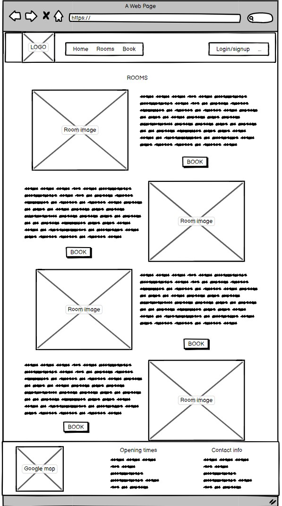
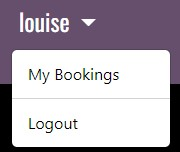

# Escape Room 

This is a booking application for an escape room company. If the consumer would like to have some fun by trying to complete an escape room they can browse the site where they will find all the rooms available to play, be able to create an account and complete a booking of their chosen date and time and a dashboard for the user to manage all of their bookings. The admin can view all bookings to see the upcoming bookings they have for the days ahead with all information provided.

# Live Site

[Escape room](https://fred-escape-room-app.herokuapp.com/)

# Content

* [Business Goals](#business-goals)

* [User experience](#user-experience)
    * [User stories](#user-stories)
    * [Agile Methodology](#agile-methodology)
    * [Crud Functionality](#crud-functionality)
    * [Database Diagram](#database-diagram)
    * [Wireframes](#wireframes)

* [Feautres](#features)
    * [Header](#header)
    * [Hero image](#hero-image)
    * [Most popular rooms](#most-popular-rooms)
    * [About us](#about-us)
    * [Footer](#footer)
    * [Rooms](#rooms)
    * [Make a booking sign up/Login](#make-a-booking-message)
    * [Create an account](#create-an-account)
    * [Sign in](#sign-in)
    * [Log out](#log-out)
    * [Place your booking](#place-your-booking)
    * [Time slot unavailable message](#time-slot-unavailable-message)
    * [Email confirmations](#email-confirmations)
    * [Manage booking](#manage-booking)
    * [Update booking](#update-booking)
    * [Updated message](#updated-message)
    * [Admin panel](#admin-panel)
    * [404 Page](#404-page)

* [Testing](#testing)
    * [Lighthouse](#lighthouse)
    * [Manual](#manual)

* [Security Features](#security-features)

* [Bugs](#bugs)
    * [Solved](#solved)
    * [Left to solve](#left-to-solve)

* [Credits](#credits)
    * [Code](#code) 
    * [Images](#images)
    * [Technology used](#technology-used)

* [Deployment](#deployment)
    * [Local deployment](#local-deployment)
    * [Production Deployment](#production-deployment) 
        * [Create heroku app](#create-heroku-app)
        * [Connect Postgres database](#connect-postgres-database)
        * [Deploy app on heroku](#deploy-app-on-heroku)
        * [PostgreSql](#postgresql)

* [Acknowledgements](#acknowledgements)

# Business goals

The main goal of this project is to give a user the ability to book a specific time and date for which room they would like to play at Escape room.The user should also get a good feeling and know what to expect from each of the games. If the user makes a booking, they should be able to make updates to their booking and also cancel their booking from the user account page.

# User experience

As an unauthorised user:
* I can navigate around the website easily and efficiently to view all of the required content
* I can view information about the business such as location and opening times
* I can view all of the rooms to see if I would like to attend
* I can view all the details about each individual room
* I can easily create an account so I can make a booking
* The process of making an account is simple and easy

As an authorised user:
* I can do everything an unauthorised user can
* I can make booking for a specific time and date for what room I would like to play
* I get an email confirmation of my booking 
* I can update my booking to change the date or time
* I can cancel my booking

As an admin, I can:
* View all of the bookings that have been placed
* I can update any of the rooms from the panel
* I can delete or update any bookings from the panel

## User stories
* As a user I can register an account so that I can make bookings
* As a user I can logout so that my information is protected on my device
* As a user I can navigate easily across the website so that I can view everything and take actions easily
* As a user I can receive an email after booking so that I can confirm my booking info
* As a user I can cancel my booking so that I have flexibility in my decisions
* As a user I can book a time so that I can attend the escape room
* As a user I can edit a booking so that I can rearrange for a different time
* As a user I can view my information so that I can check when my bookings are
* As a user I can login so that I can see my user information and bookings
* As a user I can see a google maps api location so that I can plan my journey to the company location
* As a user I can see a footer so that I can read additional information about the company
* As a user I can read the about us section so that I can decide if its something I would like to do
* As a user I can see the rooms they have to offer so that I can choose what room Id like to play
* As a user I can click the book button on the home page so that I can be taken to the booking page

## Admin stories
* As a site admin I can add an option that if the user tries to book an appointment without login/sign up, users will be asked to login/sign up.
* As a site admin I can view all the bookings so that I can plan the day ahead
* As a site admin I can display a hero image so that the user knows exactly what webpage this is

## Agile Methodology

An Agile approach to creating this app has been applied. Githubs projects was used to track user stories and implement ideas based on their level of importance for allowing use of the app with no loss of functionality or user experience.Two categories were created indicating their level of importance, those were:

* MUST HAVE
* SHOULD HAVE

By using AGILE methodology in this project I was able to deliver a site which had all required functionality and was able to give even more extra detail when going through the project.

I used GitHub projects board to create the user stories and keep track of my tasks. Here is the link to my board - [Project board](https://github.com/users/fredboys/projects/8/views/1)

Here is also a screenshot overview

## CRUD functionality

Escape room handles data with full CRUD Functionality:

Create - User can create an account and booking of their specific requirements.
Read - Users can view their booking in the manage booking section.
Update - Users can update their booking by changing anything within the form.
Delete - Users can delete their booking.

## Database diagram

## Wireframes

I built these wireframes with balsamiq to help me get a design ready for the website. The final website may look different form the inital wireframes.

It's assumed that on smaller devices such s tablets and mobile phones,multiple column presentations such as room images on the home page, room imagery and details on the rooms page, and the columns of the footer would stack to one column. Also the navbar on smaller screens will come to one and provide a dropdown.

This is the wireframe for the homepage. It has a base navbar and footer. Includes a hero image and welcome text. Then a little picture montage of the rooms. Then an about us section

The room page will shwcase the rooms with a nice design.

The booking form will be simple and clean with just the key information required.

Te manage booking section will have an update and cancel booking button. Making the booking managable for the users.

# Features

## Header
The header is the main navigation of the site. It allows the user to access all parts of the webpage with just a single click.
It has a nice contrasting colour between the background colour and the text colour. When the user hovers over the text, there will be a slight
change in colour which will notify the user that it is a clickable link. The navbar has been split into two, on the left is the links to 
access the contents of the webpage and on the right is all the user information pages.

## Hero image
The hero image is very big and prominent. It makes it obvious to the user what this webpage is about. The text in the center welcomes the user and 
it also has a button to book, which gives the user direct access to the booking page.

## Most popular rooms
In this section, it promotes the 3 most popular rooms with a small description of what the rooms are. From here the user can go to the booking page through the "book" link. 

## About us
At the bottom of the home page the user can find an about us section. This is where the user can understand a bit more about who runs the comapny and more on what it is.

## Footer
The footer hold all the important information that the user will want to know about the company. This includes a Google Maps API of the location of the business so 
the user can make a plan of how they are going to get to the location. It also tells the user the opening and closing times of the comapany so they can decided what time they would like to play. It also shows the contact information if the user needed to contact the company. 

## Rooms
This section provides the user with the information to all of the rooms. From here the user can read up about all of the rooms and see the prices, capacity and duration to make a decision on what room they want to play. Each room has a book button which will take the user straight to the booking page.

## Make a booking message
If the user isnt logged in they will be asked to either log in or create an account. They will be promted with two buttons which will take them to the allauth form they require to procede with making a booking.

## Create an account 
Here the user in prompted with 4 simple inputs to create an account. If they already have an account there is a link that will take them to the "sign in" page instead. Once the user has entered the information they can submit and they will have created an account ready to make a booking.

## Sign in
Here the user in prompted with 2 simple inputs to sign in with. If they dont have an account there is a link that will take them to the "sign up" page instead. Once the user has entered the information they can sign in and they will be ready to make a booking.

## Log out
If the user wishes to log out they will be redirected to this page where they will be asked to confirm that they want to log out.

## Place your booking
Once the user is ready to make a booking they will be able to fill out this form. Here they will be asked for their first name, last name, email, phone number, date they would like to play, time they would like to play and which room they would like to play. The date will have a datepicker dropdown which makes it easy for the user to select their chosen date. The time will have a dropdwon for the times between 10am and 6pm to make it clear to the user that these are the times of opening. Once the user is happy they can submit their booking request.

## Time slot unavailable message
If the users desired booking as already been placed by someones else, this message will appear at the the top of the form. The user can then select another date or time of their choice.

## Email confirmations
When a successful booking has been placed they will be redirected to this page. They will get a thank you message and a confirmation email of the details they have choosen. The user can then access their booking from this page by clicking on the link.

## Dropdown
Once logged in the user can see they are logged in because their username will appear in the navbar. From here there will be a dropdown where the user can access their bookings from and where they can also log out from.

## Manage bookings
If the user has a booking, they can view, update or delete their booking from this section. The details of their booking will be shown here alongside with two buttons. One to delete and one to update.

If they do not have any booking they will be shown this screen. Here there is a button they can click to take them to the booking form to make one if they want to.

## Update booking
If the user wants to update their booking they will be taken back to the form. All of their previous information will already be here in place. The user can then update anything they need to. They will get the prompt if the slot is already taken again. Once they are happy with their new details they can submit and the changes will be shown in the manage bookings area.

## Updated message
Once they submit the update. This message will appear to confirm their changes and they will also get a confirmation email with their new booking.

## Cancel confirmation
If the user want to cancel their booking they can. Once they press the red cancel button they will be prompted by this alert. This is where they can confirm that they want to delete their booking and give double confirmation.

Once they confirm they will be shown this message and the changes will reflect in the manage bookings area.

## Admin panel
The admin can access this panel by logging in with the superuser details. They will be able to get an overview of all of the information about the website. Including the information of the users, the rooms and the bookings.

Here the admins can see the bookings that have been placed. They will see all of the important information about the booking such as time, date, name of the booker, room name and email. The admin has an option to delete bookings from the system from this panel.

Here the admin can alter any of the information about the rooms including the name, price, duration, capacity, description or image. They can also add new rooms if they wish to expand of even remove rooms.

## 404 Page
This is the page the users will be shown if they have an incorrect url for whatever reason. they will have a link they can press to take them back to the home page.

## Future Features

* Add newsletter to send discounts and room updates
* Have times solved for each room that is updated by each visit
* Automate Top times for each room

# Testing

## Lighthouse
The application has been tested with Chrome Dev Tools Lighthouse Testing which tests the application for:

* Performance
* Accessibility
* Best Practices
* SEO

### Home Page

### Room Page

### Booking Page

### Account Page

## HTML Validator

When running my HTML code through the [HTML Validation service](https://validator.w3.org/), I encountered a few minor errors that have now all be corrected.

This is the base/index.html page -

This is the rooms page -

## CSS Validator
When running my CSS code through the [CSS Validation service](https://jigsaw.w3.org/css-validator/) I had no bugs.

## Python Vaildator
When running my code through the [CI Python Linter Validation](https://pep8ci.herokuapp.com/) I had no bugs or errors. Ive decided to ignore the 2 lines too long errors

This is in my webapp - admin.py

This is in my webapp - forms.py

This is in my webapp - urls.py

This is in my webapp - views.py

## JSHint Validator
When running my JavaScript through [JSHint validator](https://jshint.com/) I had no bugs or erros.

## Manual

Testing has been done manually with the google chrome dev tools to make sure the website is fully responsive. I have checked all pages at all key breakpoints to make sure the layout remains user friendly and nothing clashes.

I manually tested all buttons, forms and links to make sure the correct action took place. Here are tables to show the testing.

### Nav bar

| What is being tested | Whats supposed to happen | Pass/Fail |
| --- | --- | --- |
| logo   | Takes you to the home page     | PASS    | 
| Home link     |   Takes you to the home page     | PASS      |
| Rooms link   | Takes you to the rooms page     | PASS    | 
| Book link     |   Takes you to the booking page or sign in/sign up page     | PASS      |
| login/sign up link   | Takes you to the sign in page     | PASS    | 

### Footer

| What is being tested | Whats supposed to happen | Pass/Fail |
| --- | --- | --- |
| google maps   | allows you to see the location     | PASS    | 
| Facebook link     |   Takes you to the facebook page     | PASS      |
| Instagram link   | Takes you to the instagram page     | PASS    | 
| Twitter link     |   Takes you to the twitter page     | PASS      |

### Home page

| What is being tested | Whats supposed to happen | Pass/Fail |
| --- | --- | --- |
| hero button   | Takes you to the booking page or sign in/sign up page     | PASS    | 
| popular room link     |   Takes you to the booking page or sign in/sign up page     | PASS      |

### Rooms page

| What is being tested | Whats supposed to happen | Pass/Fail |
| --- | --- | --- |
| rooms book button   | Takes you to the booking page or sign in/sign up page     | PASS    |

### Create an account or Sign in to make a booking page

| What is being tested | Whats supposed to happen | Pass/Fail |
| --- | --- | --- |
| sign in button   | Takes you to the  sign in   | PASS    | 
| sign up button     |   Takes you to the sign up page     | PASS      |

### Create an account form page

| What is being tested | Whats supposed to happen | Pass/Fail |
| --- | --- | --- |
| sign in link   | redirects to login form   | PASS    | 
| All inputs   | make sure they're all valid   | PASS    | 
| sign up button     |   Creates your account and redirects to home page     | PASS      |

### Sign in form page

| What is being tested | Whats supposed to happen | Pass/Fail |
| --- | --- | --- |
| Sign up link   | redirects to create an account form   | PASS    | 
| All inputs   | make sure they're all valid   | PASS    | 
| sign in button     |   Sign in to your account and redirects to home page     | PASS      |

### Nav bar dropdown once logged in

| What is being tested | Whats supposed to happen | Pass/Fail |
| --- | --- | --- |
| Dropdown   | brings a dropdown for two options   | PASS    | 
| booking link   | redirects to manage booking page   | PASS    | 
| logout link     |   takes you to confirm logout     | PASS      |

### Booking page

| What is being tested | Whats supposed to happen | Pass/Fail |
| --- | --- | --- |
| All inputs   | make sure all inputs are valid before submitting   | PASS    | 
| datepicker   | datepicker should appear   | PASS    |
| timepicker   | timepicker should appear   | PASS    | 
| submit button   | submit form and a confirmation message appears on new page   | PASS    | 

### Manage booking page

| What is being tested | Whats supposed to happen | Pass/Fail |
| --- | --- | --- |
| Update button   | takes you to the booking form   | PASS    | 
| Cancel button   | bbrings up an alert to confirm cancel   | PASS    |

### Manage booking bo booking page

| What is being tested | Whats supposed to happen | Pass/Fail |
| --- | --- | --- |
| Book button   | takes you to the booking form   | PASS    | 

# Security Features

* Users cannot deduce the delete url and delete others bookings, they get a custom 500 error page if they do this when not logged in and a warning message if they are authenticated

* Users cannot deduce the update ulr and update others’ bookings, they get a custom 500 error page if they attempt to do this.

## User authentication
* Django's all auth was used for login and sign up functionality.
* Django's superuser is used to limit access to admin panel.

## Form Validation
* Extensive form validation is used on front end as well as backend.

## Database Security
* All secret keys connecting the database are stored in a env.py file that is never pushed to github. Furthermore, Cross-Site Request Forgery (CSFR) tokens were used on all forms throughout the project.

# Bugs

## Solved

* I had some contrasting issues which I fixed by using devtools and using their recommended colours

* I had two main bugs in my project. These two bugs would allow hackers to delete and update someone else's bookings. I first had to check if the user that was trying to update or cancel the booking, owned that booking. I done that through this code - 

* Then I had to write an if statement to allow the authenticated user to continue their action. If not they get a custom 500 error page.

## Left to solve

There are no more bugs to solve as of 18/01/2023

# Credits

## Code 

* I used [this website](https://timepicker.co/?fbclid=IwAR2OiqEuDfKTM7438Gk72GFZjP0l4ze-A7aRiBSfE4FAJeH0Q8jIjk_-EcY) to make the datetime picker.
* I used [this website](https://opensource.com/article/22/12/django-send-emails-smtp) to send emails to the users.
* I used [this website](https://developers.google.com/maps/documentation/embed/get-api-key) to help me create the google maps API.
* I used [this website](https://docs.djangoproject.com/en/3.2/ref/templates/builtins/#for-empty) to help me with for loops on my_booking.html

## Images

I used the following website to get my free stock images from -

* [Pexels](https://www.pexels.com/)
* [Unsplash](https://unsplash.com/)

## Technology used

* [Django](https://www.djangoproject.com/) - A model-view-template framework used to create Locksmith Booking
* [Bootstrap](https://getbootstrap.com/) - A CSS framework used for the front end development.
* [HTML5](https://en.wikipedia.org/wiki/HTML) - Provides the content and structure for the website.
* [CSS3](https://en.wikipedia.org/wiki/CSS) - Provides the styling for the website.
* [JavaScript](https://www.javascript.com/) - Provides interactive elements of the website
* [Python](https://www.python.org/) - Provides the functionality of the website.
* [Gitpod](https://www.gitpod.io/) - Used to create and edit the website.
* [GitHub](https://github.com/) - Used to host the repository.
* [Google Chrome DevTools](https://developer.chrome.com/docs/devtools/) - Used to test responsiveness and debug.
* [Am I Responsive](https://ui.dev/amiresponsive) - Used to generate mockup of my webpage.
* [Cloudinary](https://cloudinary.com/) - Used to host all static files and images.
* [Heroku](https://id.heroku.com/login) - Used to deploy the website.
* [CI Python Linter](https://pep8ci.herokuapp.com/) - Used to validate Python code.
* [HTML Validation](https://validator.w3.org/) - Used to validate HTML code.
* [CSS Validation](https://jigsaw.w3.org/css-validator/) - Used to validate CSS code.
* [JSHint Validation](https://jshint.com/) - Used to validate JavaScript code.

# Deployment

## Local deployment
To test the app locally, the terminal within VScode was used. The steps to run this:

* In your project workspace folder, open a terminal
* Run the command: python3 manage.py runserver
* Hit the 'open browser' button or visit http://localhost:8000/ in the browser.
* Use the website as usual.

A local database was used for most of the local deployment usage, since it was necessary for the automated tests to run. However, the switch to using the production database could be easily made, in case migrations needed to be performed or otherwise. Furthermore, in the development version, DEBUG was set to False, so error messages would show follow.

## Production delpoyment 
Eacape room is deployed to Heroku, using an ElephantSQL Postgres database. To duplicate deployment to Heroku, follow these steps:

* Fork or clone this repository in GitHub.
* You will need a Cloudinary account to host user images and static files.
* Login to Cloudinary.
* Select the 'dashboard' option.
* Copy the value of the 'API Environment variable' from the part starting cloudinary:// to the end. You may need to select the eye icon to view the full environment variable.Paste this value somewhere for safe keeping as you will need it shortly (but destroy after deployment).
* Log in to Heroku.
* Select 'Create new app' from the 'New' menu at the top right.
* Enter a name for the app and select the appropriate region.
* Select 'Create app'.
* Select 'Settings' from the menu at the top.
* Login to ElephantSQL.
* Click 'Create new instance' on the dashboard.
* Name the 'plan' and select the 'Tiny Turtle (free)' plan.
* Select 'select region'.
* Choose the nearest data centre to your location.
* Click 'Review'.
* Go to the ElephantSQL dashboard and click on the 'database instance name' for this project.
* Copy the ElephantSQL database URL to your clipboard (this starts with postgres://).
* Return to the Heroku dashboard.
* Select the 'settings' tab.
* Locate the 'reveal config vars' link and select.
* Enter the following config var names and values:
* CLOUDINARY_URL: your cloudinary URL as obtained above
* DATABASE_URL: your ElephantSQL postgres database URL as obtained above
* PORT: 8000
* SECRET_KEY: your secret key
* Select the 'Deploy' tab at the top.
* Select 'GitHub' and confirm you wish to deploy using GitHub. You may be asked to enter your GitHub password.
* Find the 'Connect to GitHub' section and use the search box to locate your repo.
* Select 'Connect' when found.
* Optionally choose the main branch under 'Automatic Deploys' and select 'Enable Automatic Deploys' if you wish your deployed site to be automatically redeployed every time you push changes to GitHub.
* Find the 'Manual Deploy' section, choose 'main' as the branch to deploy and select 'Deploy Branch'.
* Your site will shortly be deployed and you will be given a link to the deployed site when the process is complete.

# Acknowledgements

A huge thanks to my mentor Malia for going through my project and helping me with any issues I had to deal with.