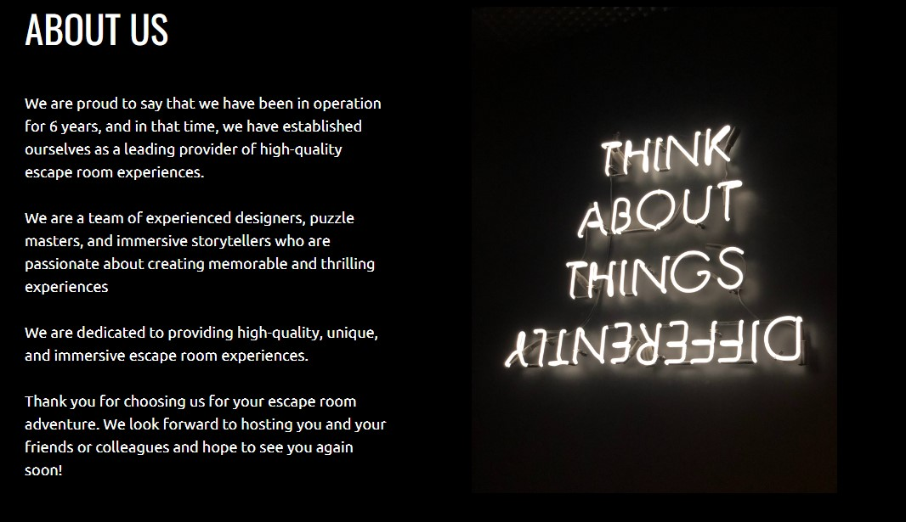

# Escape Room 

This is a booking application for an escape room company. If the consumer would like to have some fun by trying to complete an escape room they can browse the site where they will find all the rooms available to play, be able to create an account and complete a booking of their chosen date and time and a dashboard for the user to manage all of their bookings. The admin can view all bookings to see the upcoming bookings they have for the days ahead with all information provided.

# Live Site

[Escape room](https://fred-escape-room-app.herokuapp.com/)

# Content

* [Business Goals](#business-goals)

* [User experience](#user-experience)
    * [User stories](#user-stories)
    * [Agile Methodology](#agile-methodology)
    * [Crud Functionality](#crud-functionality)
    * [Database Diagram](#database-diagram)

* [Feautres](#features)
    * [Header](#header)
    * [Hero image](#hero-image)
    * [Most popular rooms](#most-popular-rooms)
    * [About us](#about-us)
    * [Footer](#footer)
    * [Rooms](#rooms)
    * [Make a booking sign up/Login](#make-a-booking-message)
    * [Create an account](#create-an-account)
    * [Sign in](#sign-in)
    * [Log out](#log-out)
    * [Place your booking](#place-your-booking)
    * [Time slot unavailable message](#time-slot-unavailable-message)
    * [Email confirmations](#email-confirmations)
    * [Manage booking](#manage-booking)
    * [Update booking](#update-booking)
    * [Updated message](#updated-message)
    * [Admin panel](#admin-panel)
    * [404 Page](#404-page)

* [Testing](#testing)
    * [Lighthouse](#lighthouse)
    * [Manual](#manual)

* [Security Features](#security-features)

* [Bugs](#bugs)
    * [Solved](#solved)
    * [Left to solve](#left-to-solve)

* [Credits](#credits)
    * [Code](#code) 
    * [Images](#images)
    * [Technology used](#technology-used)

* [Deployment](#deployment)
    * [Local deployment](#local-deployment)
    * [Production Deployment](#production-deployment) 
        * [Create heroku app](#create-heroku-app)
        * [Connect Postgres database](#connect-postgres-database)
        * [Deploy app on heroku](#deploy-app-on-heroku)
        * [PostgreSql](#postgresql)

* [Acknowledgements](#acknowledgements)

# Business goals

The main goal of this project is to give a user the ability to book a specific time and date for which room they would like to play at Escape room.The user should also get a good feeling and know what to expect from each of the games. If the user makes a booking, they should be able to make updates to their booking and also cancel their booking from the user account page.

# User experience

As an unauthorised user:
* I can navigate around the website easily and efficiently to view all of the required content
* I can view information about the business such as location and opening times
* I can view all of the rooms to see if I would like to attend
* I can view all the details about each individual room
* I can easily create an account so I can make a booking
* The process of making an account is simple and easy

As an authorised user:
* I can do everything an unauthorised user can
* I can make booking for a specific time and date for what room I would like to play
* I get an email confirmation of my booking 
* I can update my booking to change the date or time
* I can cancel my booking

As an admin, I can:
* View all of the bookings that have been placed
* I can update any of the rooms from the panel
* I can delete or update any bookings from the panel

## User stories
* As a user I can register an account so that I can make bookings
* As a user I can logout so that my information is protected on my device
* As a user I can navigate easily across the website so that I can view everything and take actions easily
* As a user I can receive an email after booking so that I can confirm my booking info
* As a user I can cancel my booking so that I have flexibility in my decisions
* As a user I can book a time so that I can attend the escape room
* As a user I can edit a booking so that I can rearrange for a different time
* As a user I can view my information so that I can check when my bookings are
* As a user I can login so that I can see my user information and bookings
* As a user I can see a google maps api location so that I can plan my journey to the company location
* As a user I can see a footer so that I can read additional information about the company
* As a user I can read the about us section so that I can decide if its something I would like to do
* As a user I can see the rooms they have to offer so that I can choose what room Id like to play
* As a user I can click the book button on the home page so that I can be taken to the booking page

## Admin stories
* As a site admin I can add an option that if the user tries to book an appointment without login/sign up, users will be asked to login/sign up.
* As a site admin I can view all the bookings so that I can plan the day ahead
* As a site admin I can display a hero image so that the user knows exactly what webpage this is

## Agile Methodology

An Agile approach to creating this app has been applied. Githubs projects was used to track user stories and implement ideas based on their level of importance for allowing use of the app with no loss of functionality or user experience.Two categories were created indicating their level of importance, those were:

* MUST HAVE
* SHOULD HAVE

By using AGILE methodology in this project I was able to deliver a site which had all required functionality and was able to give even more extra detail when going through the project.

## CRUD functionality

Escape room handles data with full CRUD Functionality:

Create - User can create an account and booking of their specific requirements.
Read - Users can view their booking in the manage booking section.
Update - Users can update their booking by changing anything within the form.
Delete - Users can delete their booking.

## Database diagram

# Features

## Header

## Hero image

## Most popular rooms

## About us

## Footer

## Rooms

## Make a booking message

## Create an account 

## Sign in 

## Log out

## Place your booking

## Time slot unavailable message

## Email confirmations

## Dropdown

## Manage bookings

## Update booking

## Updated message

## Cancel confirmation

## Admin panel

## 404 Page

# Testing

## Lighthouse
The application has been tested with Chrome Dev Tools Lighthouse Testing which tests the application for:

* Performance
* Accessibility
* Best Practices
* SEO

### Home Page

### Room Page

### Booking Page

### Account Page

## HTML Validator

When running my HTML code through the [HTML Validation service](https://validator.w3.org/), the only errors I had were from the django code.
There were no actual HTML erros.

## CSS Validator
When running my CSS code through the [CSS Validation service](https://jigsaw.w3.org/css-validator/) I had no bugs.

## Python Vaildator
When running my code through the [CI Python Linter Validation](https://pep8ci.herokuapp.com/) I had no bugs or errors. Ive decided to ignore the 2 lines too long errors

## Manual

# Security Features

## User authentication
* Django's all auth was used for login and sign up functionality.
* Django's superuser is used to limit access to admin panel.

## Form Validation
* Extensive form validation is used on front end as well as backend.

## Database Security
* All secret keys connecting the database are stored in a env.py file that is never pushed to github. Furthermore, Cross-Site Request Forgery (CSFR) tokens were used on all forms throughout the project.

# Bugs

## Solved

* I had some contrasting issues which I fixed by used devtools and using their recommended colours

## Left to solve

There are no more bugs to solve as of 18/01/2023

# Credits

## Code 

* I used [this website](https://timepicker.co/?fbclid=IwAR2OiqEuDfKTM7438Gk72GFZjP0l4ze-A7aRiBSfE4FAJeH0Q8jIjk_-EcY) to make the datetime picker.
* I used [this website](https://opensource.com/article/22/12/django-send-emails-smtp) to send emails to the users.
* I used [this website](https://developers.google.com/maps/documentation/embed/get-api-key) to help me create the google maps API.
* I used [this website](https://docs.djangoproject.com/en/3.2/ref/templates/builtins/#for-empty) to help me with for loops on my_booking.html

## Images

I used the following website to get my free stock images from -

* [Pexels](https://www.pexels.com/)
* [Unsplash](https://unsplash.com/)

## Technology used

* [Django](https://www.djangoproject.com/) - A model-view-template framework used to create Locksmith Booking
* [Bootstrap](https://getbootstrap.com/) - A CSS framework used for the front end development.
* [HTML5](https://en.wikipedia.org/wiki/HTML) - Provides the content and structure for the website.
* [CSS3](https://en.wikipedia.org/wiki/CSS) - Provides the styling for the website.
* [JavaScript](https://www.javascript.com/) - Provides interactive elements of the website
* [Python](https://www.python.org/) - Provides the functionality of the website.
* [Gitpod](https://www.gitpod.io/) - Used to create and edit the website.
* [GitHub](https://github.com/) - Used to host the repository.
* [Google Chrome DevTools](https://developer.chrome.com/docs/devtools/) - Used to test responsiveness and debug.
* [Am I Responsive](https://ui.dev/amiresponsive) - Used to generate mockup of my webpage.
* [Cloudinary](https://cloudinary.com/) - Used to host all static files and images.
* [Heroku](https://id.heroku.com/login) - Used to deploy the website.
* [CI Python Linter](https://pep8ci.herokuapp.com/) - Used to validate Python code.
* [HTML Validation](https://validator.w3.org/) - Used to validate HTML code.
* [CSS Validation](https://jigsaw.w3.org/css-validator/) - Used to validate CSS code.
* [JSHint Validation](https://jshint.com/) - Used to validate JavaScript code.

# Deployment

## Local deployment
To test the app locally, the terminal within VScode was used. The steps to run this:

* In your project workspace folder, open a terminal
* Run the command: python3 manage.py runserver
* Hit the 'open browser' button or visit http://localhost:8000/ in the browser.
* Use the website as usual.

A local database was used for most of the local deployment usage, since it was necessary for the automated tests to run. However, the switch to using the production database could be easily made, in case migrations needed to be performed or otherwise. Furthermore, in the development version, DEBUG was set to False, so error messages would show follow.

## Production delpoyment 
Eacape room is deployed to Heroku, using an ElephantSQL Postgres database. To duplicate deployment to Heroku, follow these steps:

* Fork or clone this repository in GitHub.
* You will need a Cloudinary account to host user images and static files.
* Login to Cloudinary.
* Select the 'dashboard' option.
* Copy the value of the 'API Environment variable' from the part starting cloudinary:// to the end. You may need to select the eye icon to view the full environment variable.Paste this value somewhere for safe keeping as you will need it shortly (but destroy after deployment).
* Log in to Heroku.
* Select 'Create new app' from the 'New' menu at the top right.
* Enter a name for the app and select the appropriate region.
* Select 'Create app'.
* Select 'Settings' from the menu at the top.
* Login to ElephantSQL.
* Click 'Create new instance' on the dashboard.
* Name the 'plan' and select the 'Tiny Turtle (free)' plan.
* Select 'select region'.
* Choose the nearest data centre to your location.
* Click 'Review'.
* Go to the ElephantSQL dashboard and click on the 'database instance name' for this project.
* Copy the ElephantSQL database URL to your clipboard (this starts with postgres://).
* Return to the Heroku dashboard.
* Select the 'settings' tab.
* Locate the 'reveal config vars' link and select.
* Enter the following config var names and values:
* CLOUDINARY_URL: your cloudinary URL as obtained above
* DATABASE_URL: your ElephantSQL postgres database URL as obtained above
* PORT: 8000
* SECRET_KEY: your secret key
* Select the 'Deploy' tab at the top.
* Select 'GitHub' and confirm you wish to deploy using GitHub. You may be asked to enter your GitHub password.
* Find the 'Connect to GitHub' section and use the search box to locate your repo.
* Select 'Connect' when found.
* Optionally choose the main branch under 'Automatic Deploys' and select 'Enable Automatic Deploys' if you wish your deployed site to be automatically redeployed every time you push changes to GitHub.
* Find the 'Manual Deploy' section, choose 'main' as the branch to deploy and select 'Deploy Branch'.
* Your site will shortly be deployed and you will be given a link to the deployed site when the process is complete.

# Acknowledgements

A huge thanks to my mentor Malia for going through my project and spotting the errors and bugs for me to fix.